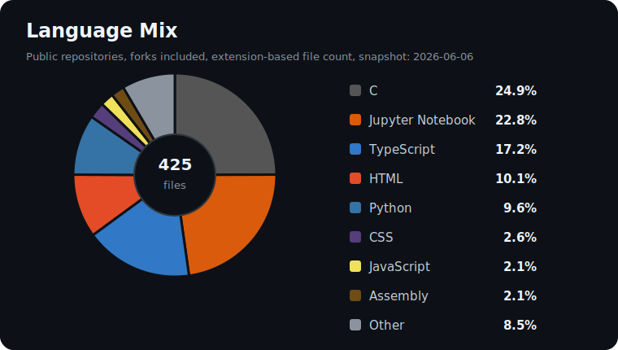

<h1 align="center">kobadaidesu</h1>

  
  

  42 Tokyo student working through C, Unix, algorithms, and the small details that make programs behave.

## Focus

- Low-level programming with C
- Data structures, sorting, parsing, and memory management
- Building small tools and projects that explain how things work under the hood

## Language Mix

  

| Language | Share |
| --- | ---: |
| Jupyter Notebook | 72.4% |
| Python | 18.0% |
| C++ | 5.6% |
| HTML | 0.9% |
| C | 0.9% |
| TypeScript | 0.8% |
| Assembly | 0.7% |
| JavaScript + Other | 0.8% |

Snapshot from public, non-fork repositories using GitHub Linguist byte counts on 2026-06-06.

## Current Direction

- C projects at 42 Tokyo
- Unix-like tooling and CLI programs
- Practical experiments with Python, TypeScript, and small web apps
